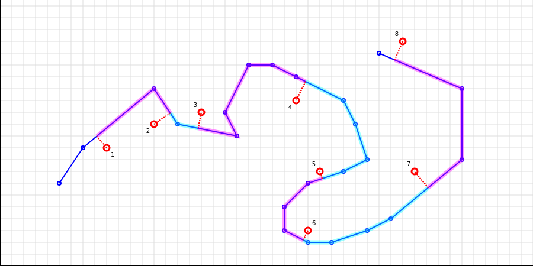
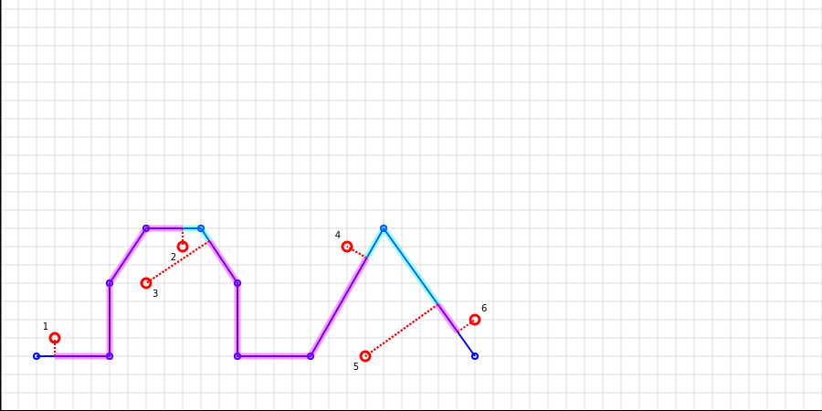
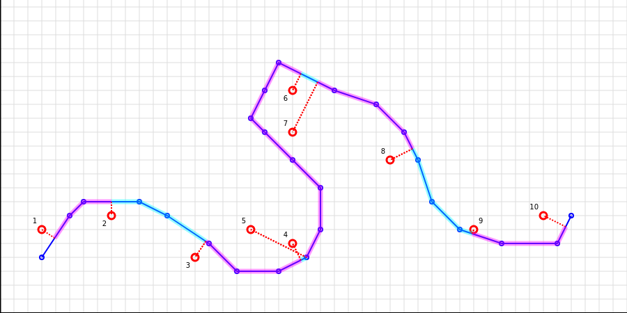

[](https://vchezganov.github.io/polysplit/tarpaulin-report.html)

**polysplit** library implements the algorithm allowing to split polylines
into segments by the defined list of points not necessary belonging to the polyline.

The image below demostrate it visually, where the polyline is blue and
the list of points is red. Dash lines present where points were projected to split the polyline,
and highlighted pink and blue areas show segments.



## Usage example
```rust
use polysplit::polyline_split;
use polysplit::euclidean::Point;

fn main() {
    let polyline = vec![
        Point(0.0, 0.0),
        Point(3.0, 0.0),
        Point(7.0, 0.0),
        Point(10.0, 0.0),
        Point(13.0, 0.0),
        Point(17.0, 0.0),
        Point(20.0, 0.0)
    ];
    let split_points = vec![
        Point(1.0, 1.0),
        Point(19.0, 1.0)
    ];

    // Without minimum distance to polyline threshold
    let segments = polyline_split(&polyline, &split_points, None).unwrap();
    println!("{:?}", segments);

    // With minimum distance to polyline threshold
    let segments = polyline_split(&polyline, &split_points, Some(20.0)).unwrap();
    println!("{:?}", segments);
}
```

---

The algorithm considers the order of points and guarantees the correct order of segments.

It allows to find solutions even in some complex cases like on the image below
(check the positions of points 2, 3 and 4, 5):



Not looking that point 3 is closer to the left part of the polyline
it is better to project it to the right part of the polyline,
so the order is correct.

---

One more example (points 4, 5 and 6, 7)



---

## Own types

**polysplit** provides **euclidean** module to be used. But `polyline_split` can be used
for your own data type. It is just required to implement `PolySplit` trait for so called
"point" data structure:
```rust
trait PolySplit<D>
where
    Self: Copy,
    D: Copy + PartialOrd + Add<Output = D>,
{
    fn distance_to_point(&self, point: &Self) -> D;
    fn distance_to_segment(&self, segment: (&Self, &Self)) -> DistanceToSegmentResult<Self, D>;
}
```
For example, it could be 3D plain `Point(x, y, z)`,
geographical `Location(longitude, latitude)` or
spherical `Point` projections.

## Other usage

Using the algorithm it is also possible to check
if two polylines are similar within the certain distance threshold.
Check (polyequal)[https://github.com/vchezganov/polyequal] library.
