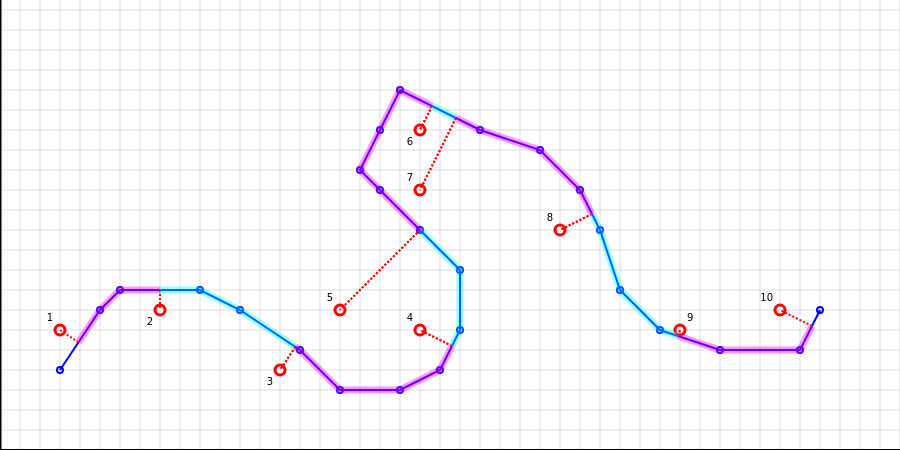

Initial commit - Proof of Concept (to be productized)

**polysplit** is the library and the algorithm allowing to split polylines
into segments defined by the list of points not necessary belonging to the polyline.

The image below demostrate it visually, where the polyline is blue and
the list of points is red. Dash lines present where points were projected to split the polyline,
and highlighted pink and blue areas show segments.

The algorithm considers the order of points and guarantees the correct order of segments.

---

It allows to find solutions even in some complex cases like on the image below
(check the positions of points 2, 3 and 4, 5):

Not looking that point 3 is closer to the left part of the polyline
it is better to project it to the right part of the polyline,
so the order is correct.

---

One more example (points 4, 5 and 6, 7)

---

Using the algorithm it is also possible to check
if two polylines are similar within the certain distance threshold.

**TODO:** To describe how it works and give an example.

**TODO:** To provide code example, how to use and how to implement own extensions.